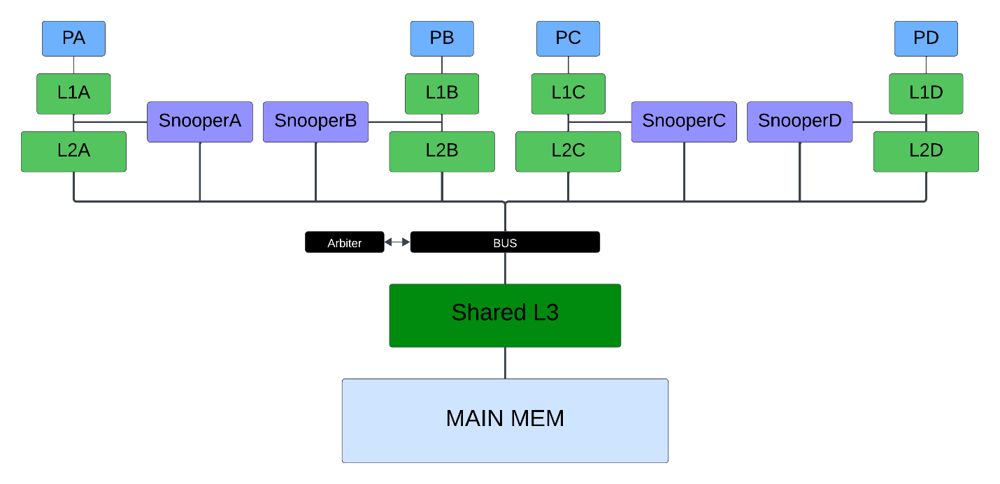
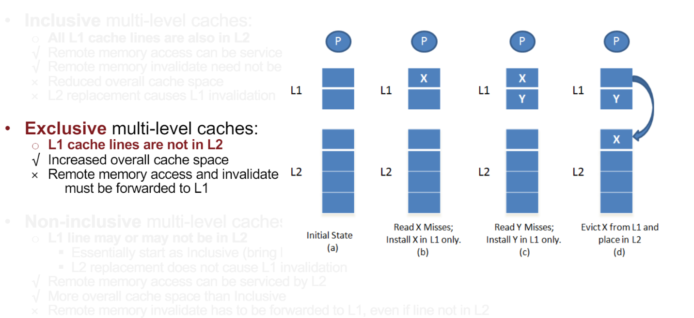
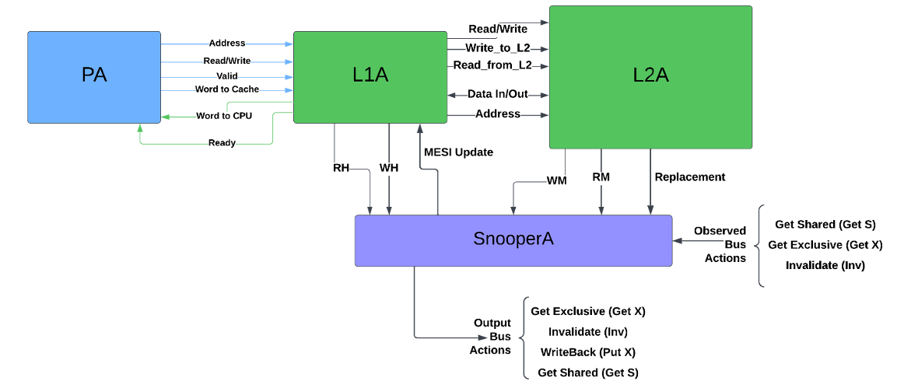
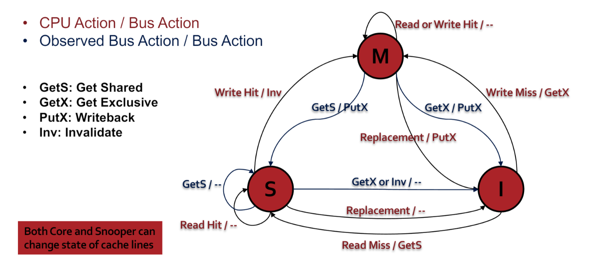
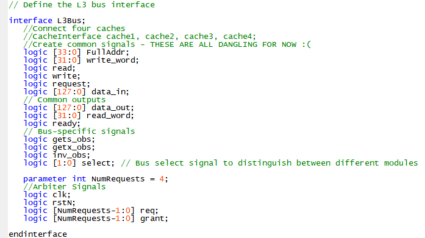
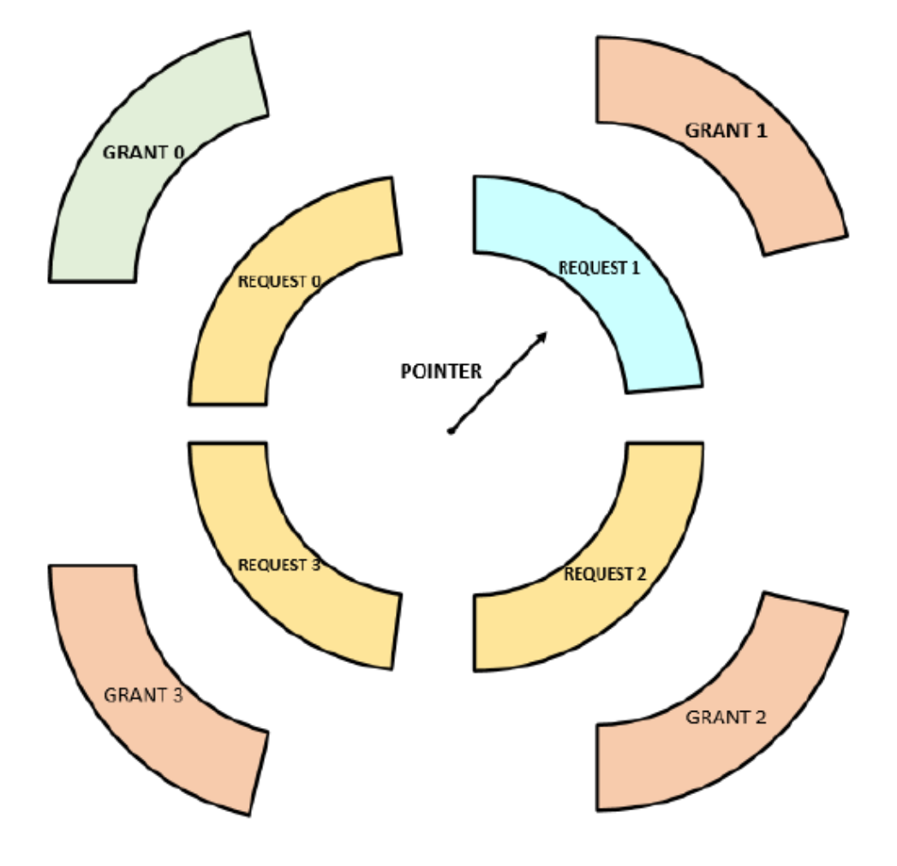
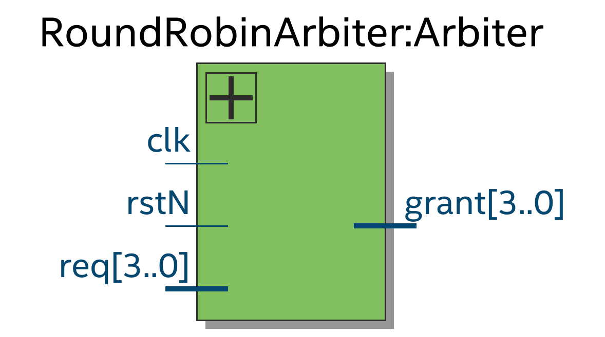
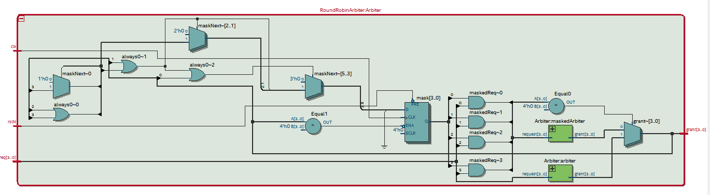
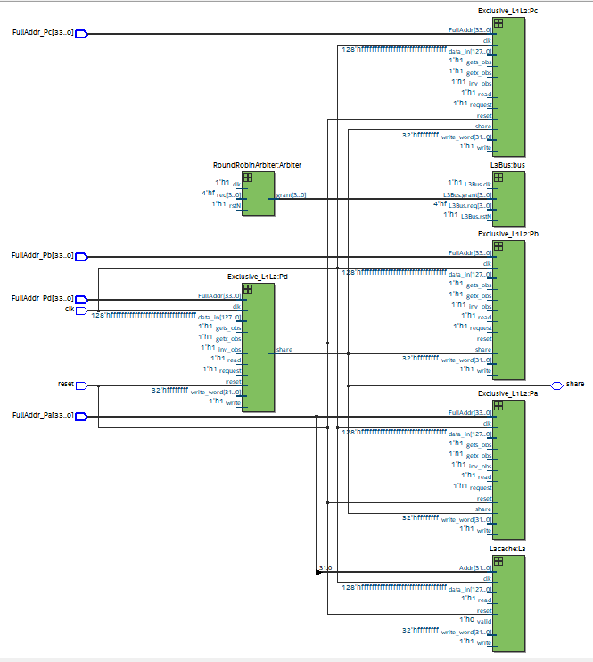
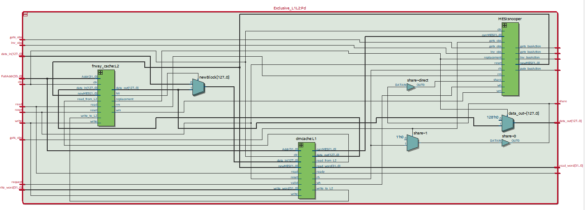

Advanced Computer Architecture: Processor Design (ECSE 4780/6700)

Abdoula Barry

## Project 1: Cache Coherence (In-Progress)

### Section 1: Design Description

**1.1 Top Level Design:**

 
  

<em>Figure 1: Top Level Hierarchy</em>

Figure 1 illustrates the hierarchy and layout of my design. Note there
are 4 processors with exclusive L1 and L2 caches respectively.
Additionally, the top level diagram features 4 MESI Snooper nodes that
monitor several things that will be touched on in more detail later. In
a general sense, any one snooper will passively peak into both the
interactions between it's L1 and L2 caches and broadcasts on the bus.
Based on certain observations, the snooper will update the state of a
given cacheline and output bus actions that are then of course
broadcasted on the bus to the rest of the system. This is a base
description of implementing cache coherence using the MESI Snooper
protocol.

**2.2 Design Parameters:**

    *32-bit Address*

    *Block Size: 4 words (16 bytes / 128 bits)*

    1.  L1 Cache

        a.  Direct-mapped Cache

        b.  Cache Size: 256 bytes \<= numRows x Block Size

        c.  Cache includes a valid and dirty bit per block

        d.  Offset: 2 bits

        e.  Cache Index: 4 bits

        f.  Tag Size: 26 bits = 32 -- (4+2)

        g.  Non-blocking

    2.  L2 Cache

        a.  4 ways, 16 sets in each way so the index value 2\^k is 4 for a
            total of 64 cache lines

        b.  Cache Size: (1024 bytes) \<= numSets \* Associativity \* block
            size

        c.  Cache Index: 4 bits

        d.  Tag Size: 26 bits

    3.  Write-back & Write-Allocate

        a.  Treating write miss as a read miss followed by a hit

    4.  Cache Inclusion Policy -- EXCLUSIVE L1/L2 Cache

        a.  Implications -- "Suppose there is a processor read request for
            block X. If the block is found in L1 cache, then the data is
            read from L1 cache and returned to the processor. If the block
            is not found in the L1 cache, but present in the L2 cache, then
            the cache block is moved from the L2 cache to the L1 cache. If
            this causes a block to be evicted from L1, the evicted block is
            then placed into L2. This is the only way L2 gets populated.
            Here, L2 behaves like a **victim cache**. If the block is not
            found in either L1 or L2, then it is fetched from main memory
            and placed just in L1 and not in L2." -
            <https://en.wikipedia.org/wiki/Cache_inclusion_policy>

        b.  Refer to Figure 2

 
  

<em>Figure 2: Exclusive Multi-level Caching</em>

**1.3 Processor \<-\> L1 \<-\> L2 \<-\> Snooper: Design and Communication**

 
  

<em>Figure 3: Exclusive Cache Communication w/ Snooper</em>

Figure 3 features the general interconnect of my exclusive L1 \<-\> L2
cache and their Snooper Node. The processor (in this example PA) and L1A
have a very typical form of communication. So much so, I will not go
into that part in detail. Simply put, PA will either ask for / load data
into L1A. I call this figure general as the details of my design in
terms of HDL is a bit more verbose and contains intermediate signals to
support the snooper, internal cache controllers, and exclusive caching
system.

To implement exclusivity, I considered L1 to be the 'host' when it comes
to external memory access, invalidates, and memory allocation. L2 is a
**victim cache** of L1 so it only gets populated when cache lines are
evicted from L1. The L1 cache controller takes memory access requests
and, if necessary, will enable either the **Read_from_L2** or
**Write_to_L2 signal** which request data from L2 and place data in L2
respectively. With this in mind, it's important to note that this
policy, at least from my perspective, means that a true **Read Miss**
(RM) and **Write Miss** (WM) can only be driven by L2. As it's designed,
if data is not found in L1 or L2, based on the action (r/w), L2's cache
controller will tell the **Snooper** about the miss. Furthermore, upon a
**cache eviction** in L1, if there is no space for the evicted block in
L2, the L2 cache controller will then drive the **replacement** signal
to the Snooper high. This is part of the write-back and allocation
scheme and will tell the Snooper to write the data to a higher-level of
memory. Note: the snooper will only do this because this cache line is
consequently in the **Modified State** as tracked by the snooper itself.
In other words, this cache line was seen as **dirty** by L1 as it's been
previously written to.

Another consequence of this exclusive policy that naturally follows is
that only L1 observes **Read Hits** (RH) and **Write Hits** (WH) which
the snooper will, again, track.

 
  

<em>Figure 4: MESI -- 1</em>

 
  

<em>Figure 5: MESI -- Full</em>

Figures 4 and 5 (taken directly from lecture) detail the state
transition diagram and subsequent logic of the MESI Snooper nodes. I
used this state transition diagram to motivate my understanding of the
Snooper's purpose and how it should be best designed. As seen in Figure
3, from a high-level abstraction, I've designed my snooper to of course
take in the CPU Action inputs and observe bus actions that have been
broadcast by other snoopers.

**Inputs:**

    (i) CPU Actions: {RH, WH, RM, WM, Replacement}

    (ii) Observed Bus Actions: {GetS, GetX, Inv}

    (iii) 32-bit Data

    (iv) Address of observed requests

**Outputs:**

    (i) Bus Actions: {GetX, Inv, RM, PutX, GetS}

    (ii) 32-bit Data

    (iii) Address of inner requests

    (iv) MESI Update -- Outside of Broadcasts on the bus, my snooper will do
        all the MESI updates necessary on a given cacheline(s). This update
        is forwarded to the L1 cache which will then assign the new MESI
        state based on the address the cache line corresponds to.

This section represents the internal behavior of all of the exclusive L1
and L2 systems with their snoopers across the full design hierarchy.
Outside of containing different data, there is no reason why the basic
structure of processor A's L1\<-\>L2\<-\>Snooper system should be any
different from that of its counterparts.

**1.4 Bus Interface and Arbitration**

The bus interface is not yet complete. I know that I am going to want to
use an interface because of all the common signals shared by the 4
exclusive caches in the system. Figure 6 shows the bus thus far. This is
a general idea of how I'm thinking of designing and not final in any
way.

 
  

<em>Figure 6: Bus Interface -- Basic</em>

The Arbiter, on the other hand, is complete.

 
  

<em>Figure 7: Round Robin Arbitration</em>

I decided to use a round-robin arbiter. Its role is to prevent
unfairness and ensure equal access in a system. Unfairness, known as
starvation, happens when some requests are repeatedly denied access
while others get through. The round-robin arbiter solves this by giving
access to requests in a rotating order as seen in Figure 7. This means
each request gets a turn, preventing any from consistently missing out.
In systems with many requests for the same resource, fairness is crucial
so I thought it would work well for this project where multiple sources
will contend for resources/information. With just a regular priority
select arbiter, some requests might get favored over others, causing
performance issues.

 
  

<em>Figure 8.1: Round Robin Arbiter</em>

Without showing much, this is the high-level view of the Arbiter module
and it's IO. The internals are shown in figure 9.

 
  

<em>Figure 8.2: Round Robin Arbiter (Cont'd)</em>

Though it's hard to see, the implementation of the round robin arbiter
features two priority arbiters employed to manage requests. The first
arbiter, called the unmasked arbiter, handles the original request,
while the second, the masked arbiter, processes requests that are ANDed
with a mask. Priority is given to the masked arbiter over the unmasked
one. If no masked request exists, the result from the unmasked arbiter
is used. However, if a masked request is present, the result from the
masked arbiter takes precedence, with the mask dictating which request
holds priority. The complexity of the design lies in updating the mask
logic. When a bit is granted, subsequent bits above it must have
priority in the next cycle. To achieve this, the MSB to N+1 bits are set
to 1, while the rest are set to 0. The maskedReq expression ensures that
only requests with priority, indicated by a set mask bit, are processed
by the masked arbiter. The grant output is determined by checking if the
maskedReq expression is 0 using a ternary operator. If it is 0, the
result from the unmasked arbiter is chosen; otherwise, it\'s the result
from the masked arbiter. The maskNext variable, updated in the
combinational block, manages the priority for subsequent cycles based on
granted requests. The mask variable is updated in the synchronous block
using a flip-flop triggered by clock edges or reset signals.

**Inspiration - <https://circuitcove.com/design-examples-rr-arbiter/>**

 
  

<em>Figure 9: RTL top view</em>

This of course is incomplete and as such does not have all of the proper
connections necessary to showcase a final design. I only present this to
showcase the way I implemented the different 'blocks' of the system. I
combined the L1, L2, and snooper interactions seen in section 1.3 into
one cohesive module that represents the MESI and memory interconnect for
a given processor. Hopefully, figure 10 will further clarify the design.

 
  

<em>Figure 10: Exclusive L1 <-> L2 <-> Snooper module</em>

Hard to see but figure 10 shows the L1 , L2, and snooper modules with
supporting external logic.

## Tests and Explanations

Currently, I've only been able to verify the design of my MESI Snooper
module with a small not too comprehensive testbench to showcase the state transitions.
Please navigate to the MESISnooper folder in \rtl\ to see the results.

Thank you very much for reading my report. **This is a developing project** and I will continue to work on it in my spare time until it functions to my satisfaction. Thanks again.

##
### Current progress:

***Things that are done, things that aren't.***

***Done:***

    1.  L1 Cache - not verified

    2.  L2 Cache - not verified

    3.  Exclusive Caching - not verified

    4.  Basic MESI Snooper -- verified as-is

    5.  Arbiter - not verified

    6.  Shared L3 Cache - not verified

***Not Done:***

    1.  Full integration

    2.  Bus Interface

    3.  Full top-level verification of design
