## MESI Snooper Simulation Results

A little further background. Based on my package design in figure 11,
MESI states can be represented as such.

 
  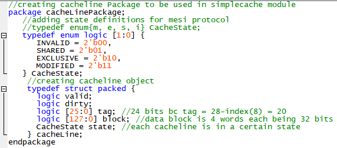

<em>Figure 11: Cache line and MESI state logic representation</em>

### Test Case 1

**Ignore the comments -- "Check if state is SHARED": Next to the assert,
I forgot to update that comment across the tests**

 
  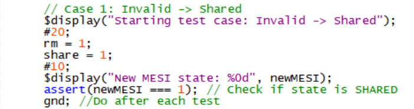

 
  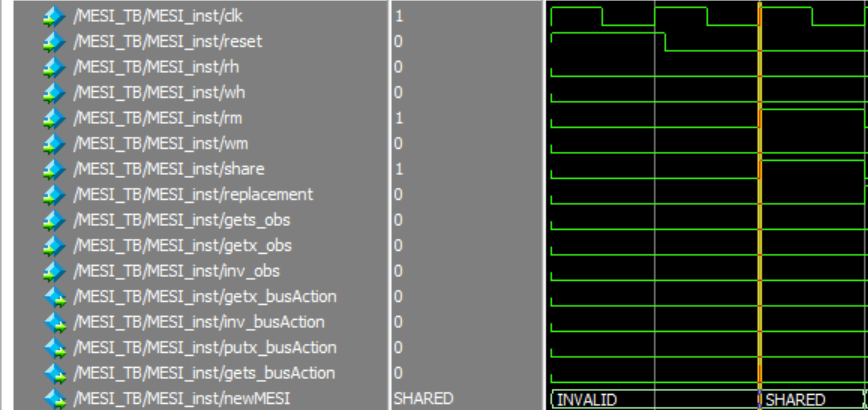

Properly goes to Shared State when snooper sees rm and share is high.
Share represents whether or not another cache has the data. For
simulation purposes share is set directly just to showcase proper MESI
update functionality.

### Test Case 2

 
  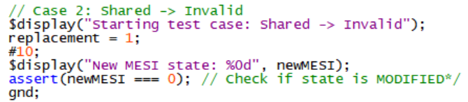

 
  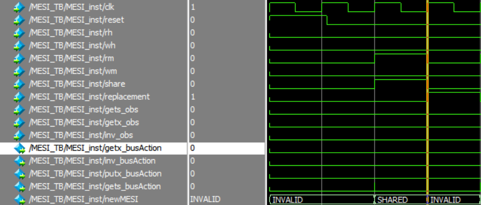

Correct transition to Invalid on replacement high

### Test Case 3

 
  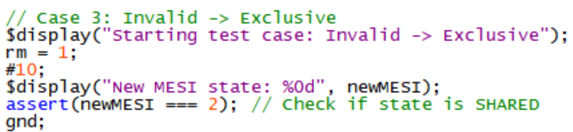

 
  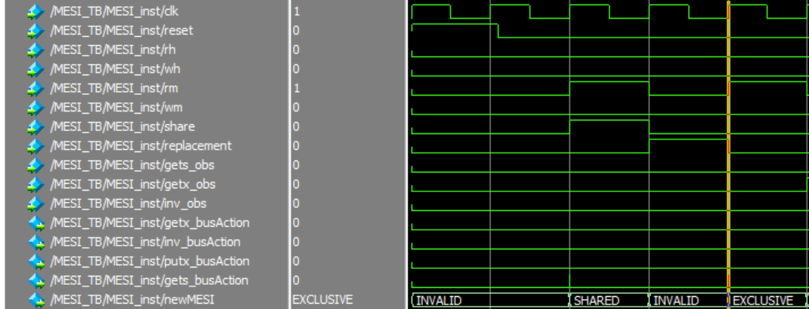

In the invalid state, on a RM with share = 0, go to exclusive. This is
correct.

### Test Case 4

 
  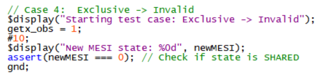

 
  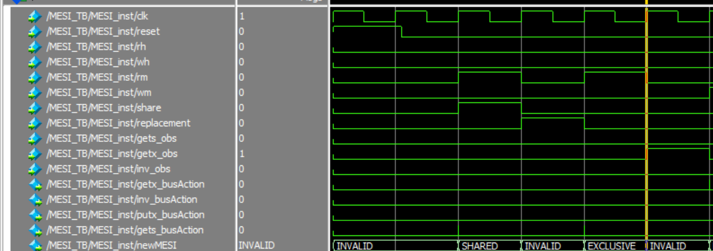

In Exclusive state, on Invalidate Observed on the bus -\> Invalid State.
This is correct.

### Test Case 5

 
  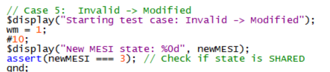

 
  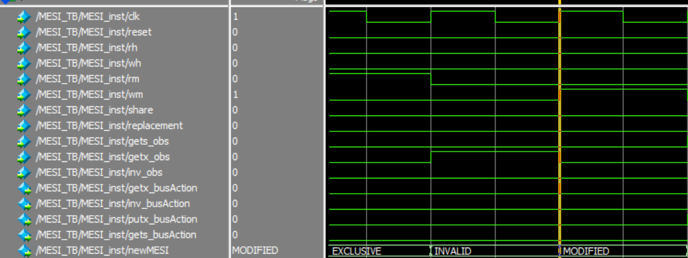

Invalid to Modified on WM. Correct.

### Test Case 6

 
  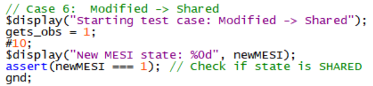

 
  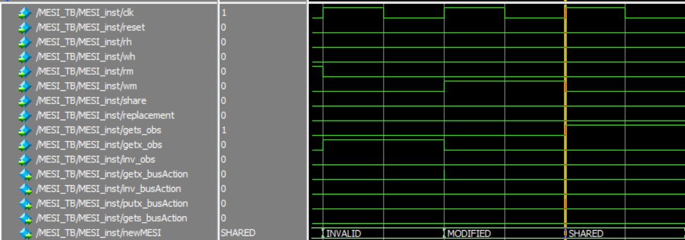

Modified to Shared on observed GetS on bus. Correct.

### Test Case 7

 
  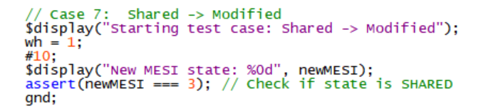

 
  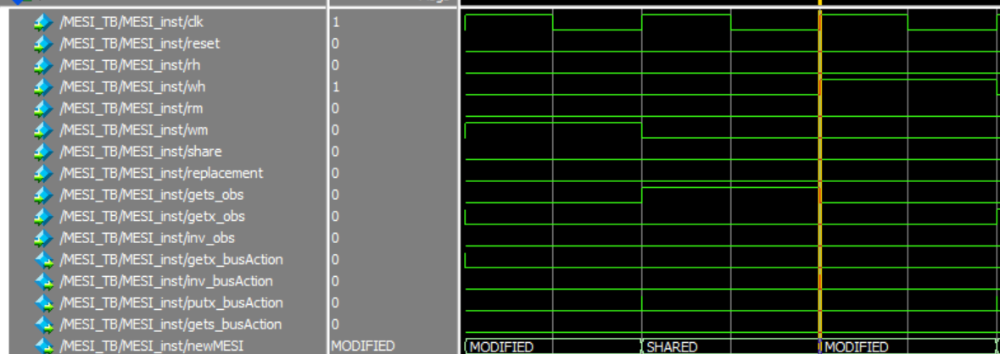

Shared to Modified on WH. Correct.

### Test Case 8

 
  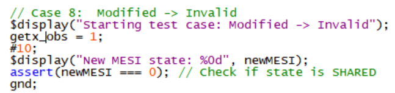

 
  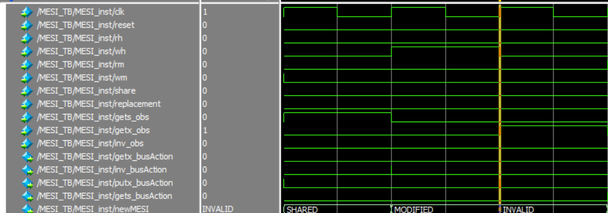

Modified to Invalid on GetX observed. Correct.

### Test Case 9

 
  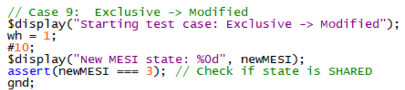

 
  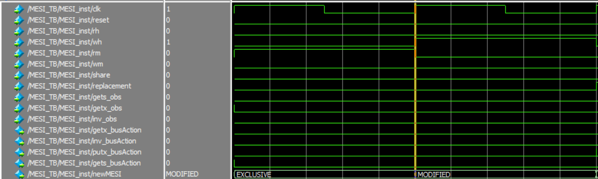

Exclusive to Modified on WH. Correct.

**These are looking more and more stretched because I'm zooming in on
the later waveforms.**

### Test Case 10

 
  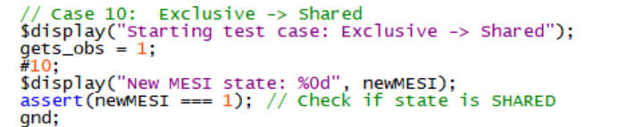

 
  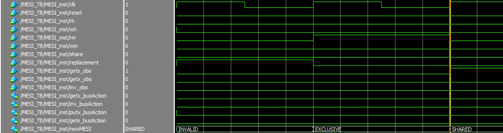

Exclusive to Shared on GetS observed on the bus. Correct.

These are all the unique transitions I've tested so far. Admittedly
there are some not shown, reason being they are transitions that remain
in the same state. For example, RH in the Exclusive state just keeps the
state as Exclusive. Furthermore, I have not shown some of the examples
such as GetX OR Inv being observed brings a cache line in the shared
state to Invalid. I figured by showing just one it would be enough as
the logic to implement this is as capitalized: just a logical OR in
Verilog. I've done this in the module. I hope this is enough to show the
proper MESI updates of the Snooper module.